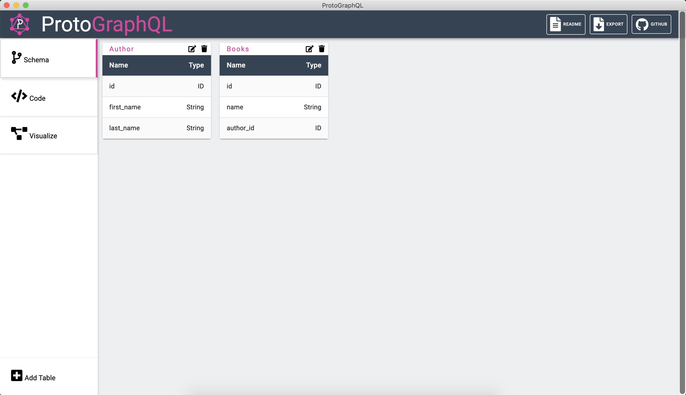
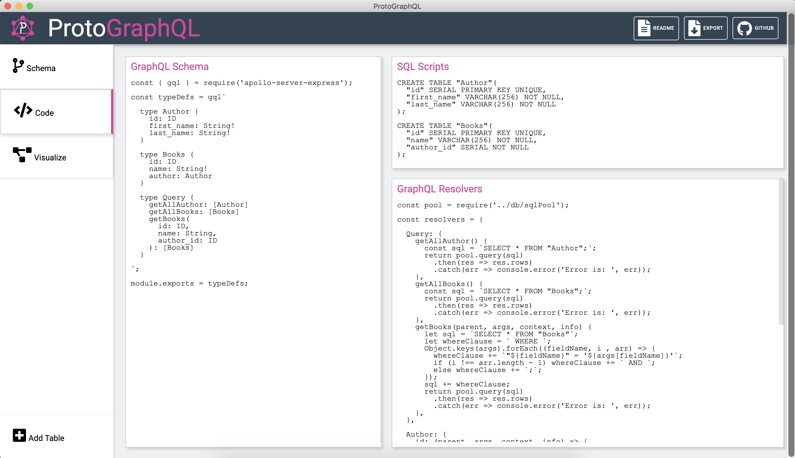
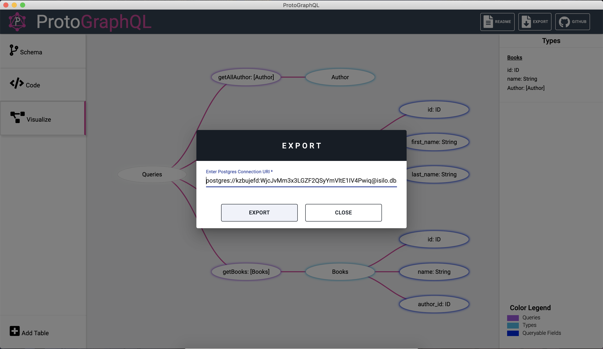

<p align="center" ></p>

# ProtoGraphQL

ProtoGraphQL is a **prototyping tool** that helps developers build and visualize GraphQL schemas and queries without writing any code. Users simply input their relational database tables and ProtoGraphQL will dynamically create a customized and functional GraphQL Apollo Server readily available for export.

ProtoGraphQL is currently in beta. We would appreciate if you could post any issues to our GitHub – we are actively looking for areas for improvement and we welcome feedback from the community.

Upcoming releases include adding visual indicators for table relationships in the “Schema” view, enabling users to create customizable GraphQL mutations, and extending support for NoSQL databases such as MongoDB.

\* *We recently added support for users to view the structures and relationships of their tables using our GraphQL schema tree visualizer!*

## Getting Started:

### Mac / Linux

1. Download [zip](INSERTURLHERE)

2. Extract file

3. Run app

## How to Use:

1.	When the application loads, click on **Add Table** and populate the table form with a name and new fields. Optionally, you may also use the last three inputs in the form to create relationships to other tables. When you are done, click **Save**.

<p align="center"><kbd></kbd><p>

2.	Navigate to the **Schema**, **Code**, and **Visualize** tabs to toggle views:
    * **Schema** - view, edit, or delete tables you've added
    
    <kbd></kbd>
    
    * **Code** - view generated GraphQL and SQL code before export
    
    <kbd></kbd>
    
    * **Visualize** - view the GraphQL schema intuitively as a simple tree
    
    <p align="center"><kbd></kbd></p>

3.	Export the code by clicking the **Export** icon. 

   <kbd></kbd>

4. Enter your Postgres database URI and then select the directory you want to save your executable GraphQL server.

## How to Run GraphQL Server:

There are several libraries we could have used to create a GraphQL server, but we decided to use Apollo Server – the most popular library to setup an endpoint for responding to incoming GraphQL requests in JavaScript.

1.	Extract apollo-server.zip file 

2. Open the project 

3.	Install dependencies 
  ```
  npm install
  ```

4.	Run the server
  ```
  npm start
  ```

5.	Use Apollo Server Playground to mock client GraphQL queries and responses to your server. [Learn more about constructing GraphQL Queries here](https://graphql.org/learn/queries/)

## Contributors:


- Alena Budzko [@AlenaBudzko](https://github.com/AlenaBudzko) 
- Bryan Fong [@bryanfong-dev](https://github.com/bryanfong-dev)
- Rodolfo Guzman [@Rodolfoguzman25](https://github.com/Rodolfoguzman25)
- Jarred Jack Harewood [@jackhajb](https://github.com/jackhajb)
- Geoffrey Lin [@geofflin](https://github.com/geofflin)

