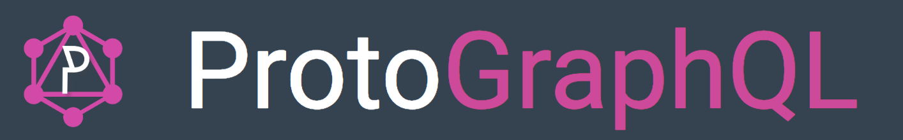
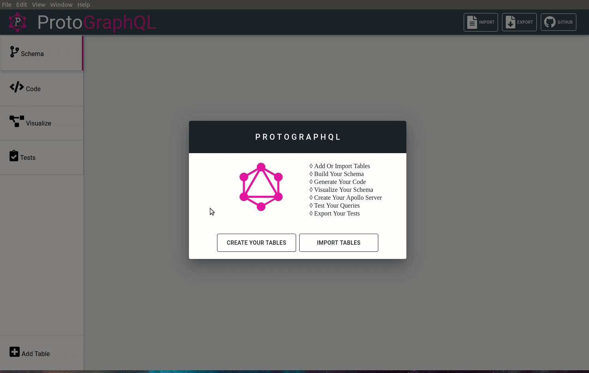
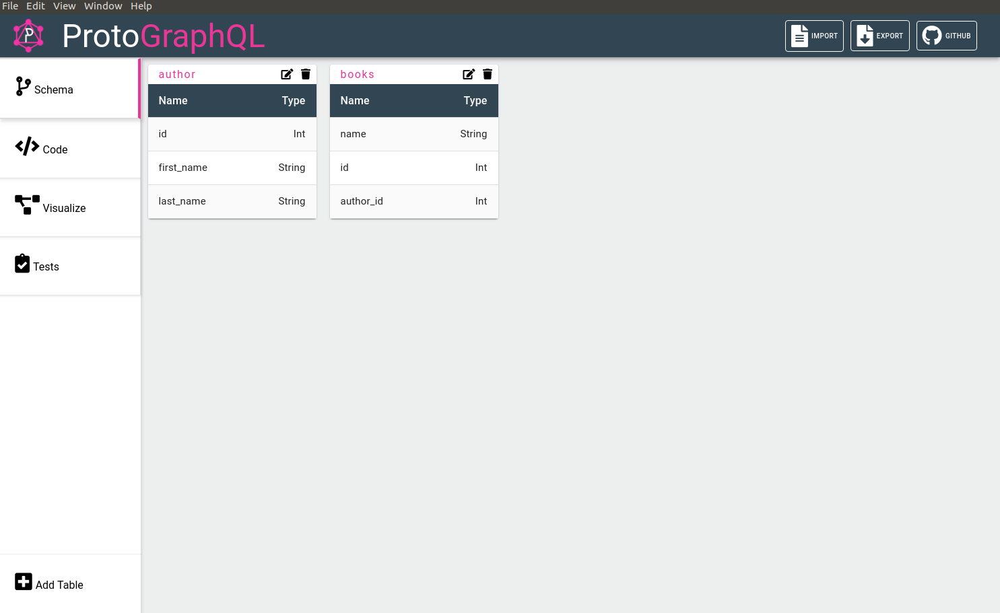
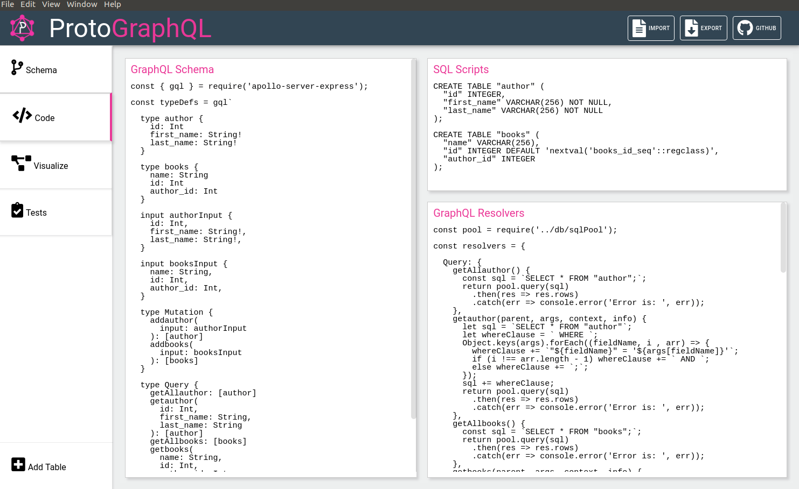
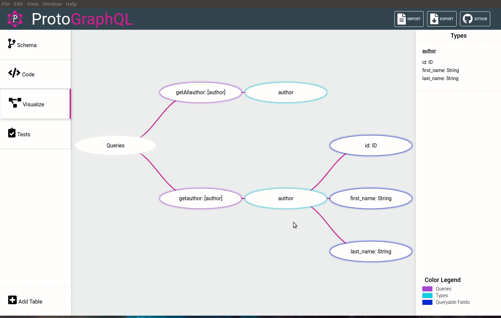
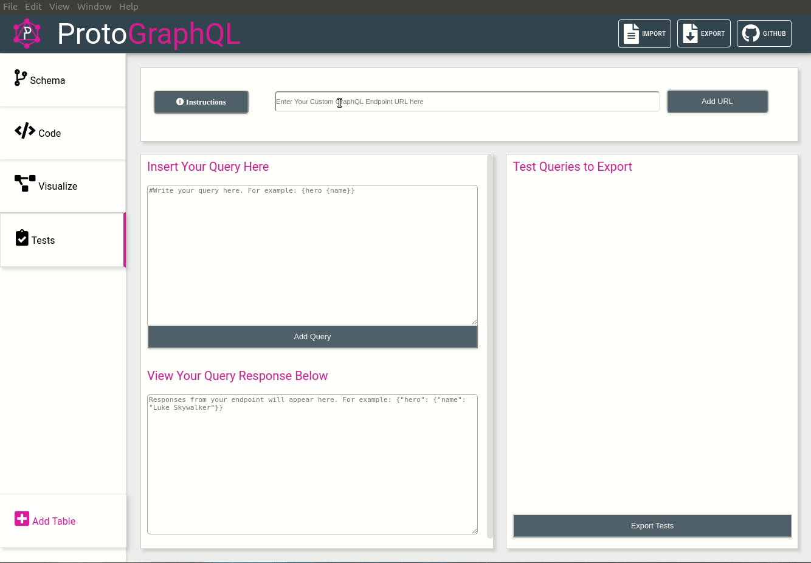
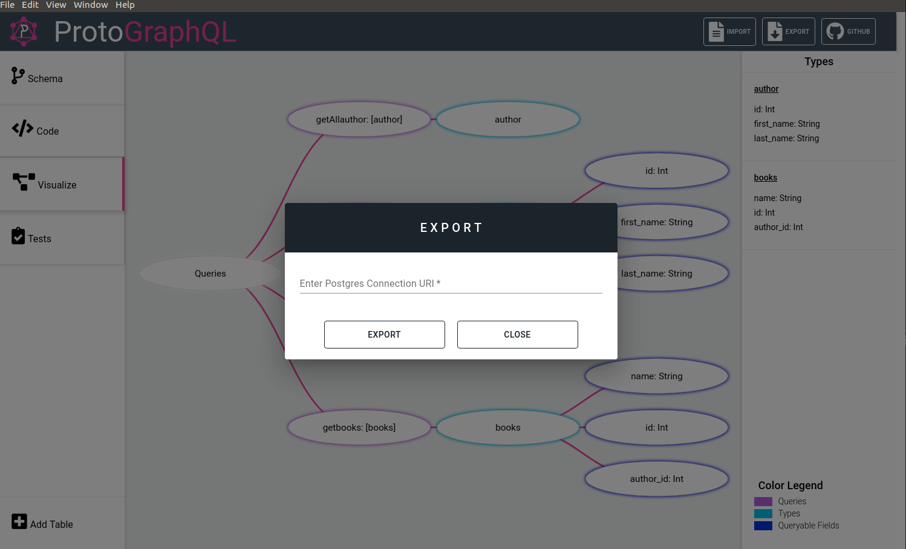
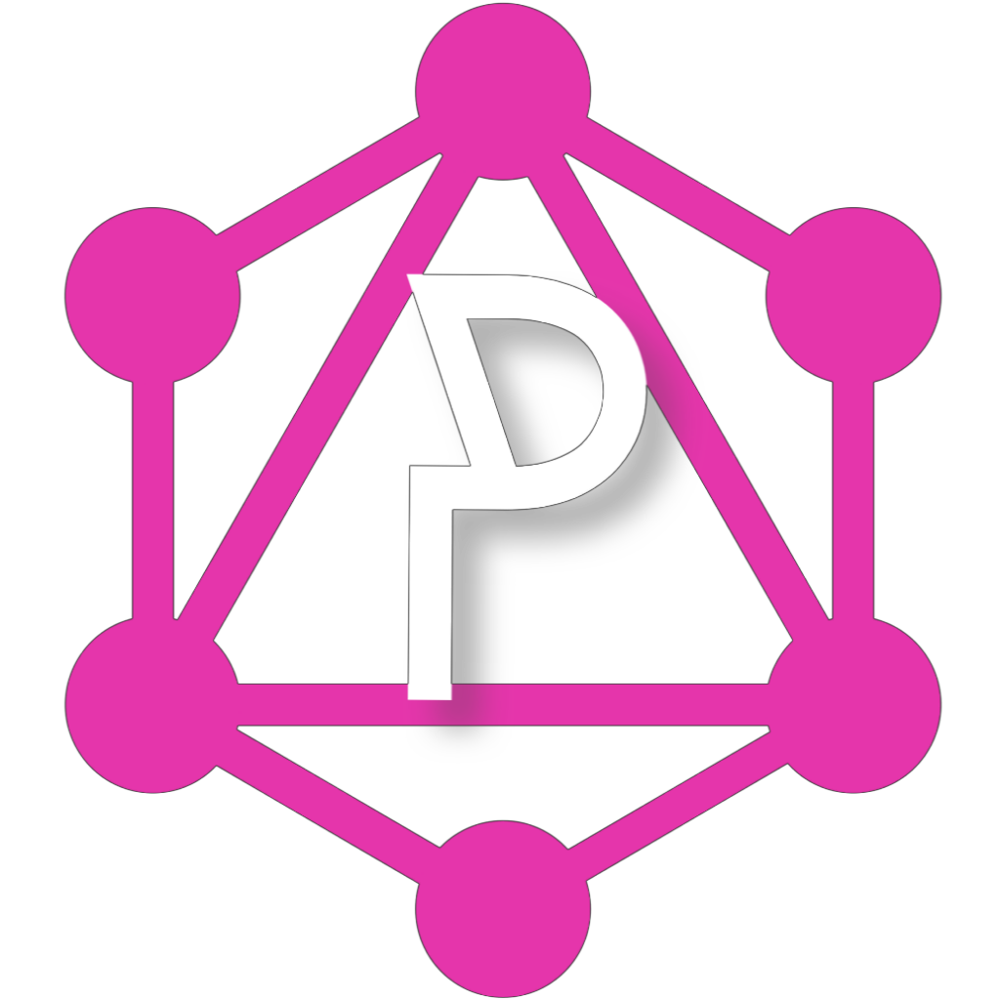

<p align="center" ></p>
 
# ProtoGraphQL ver. 2.0
 
*** The latest release of ProtoGraphQL includes a new view that can jumpstart your query testing with the Jest framework and the ability to import tables from an existing database. *** 
 
ProtoGraphQL is a **prototyping tool** that empowers developers to build and visualize GraphQL schemas and queries without writing any code. Once users import or input their relational database tables, ProtoGraphQL can generate an export package that allows developers to spin up a customized and functional GraphQL Apollo Server as an independent app. (As of version 2.0 custom mutations are also supported!)
 
ProtoGraphQL is in beta. Please post any issues to our GitHub - we are actively looking for opportunities to improve this tool and we welcome your feedback.
 
Upcoming releases will improve the “Schema” view and add support for NoSQL databases. 
 
## Getting Started:
 
1. Download: [Mac](https://github.com/oslabs-beta/protographql/releases/download/v1.0.0-beta/ProtoGraphQL-1.0.0.dmg), [Windows](https://github.com/oslabs-beta/protographql/releases/download/v1.0.0-beta/ProtoGraphQL.Setup.1.0.0.exe), [Linux](https://github.com/oslabs-beta/protographql/releases/download/v1.0.0-beta/protographql_1.0.0_amd64.deb)
 
2. Extract file
 
3. Run application
 
## How to Use:
 
1.  When the application starts you will be given the option to either **CREATE YOUR TABLES** or **IMPORT TABLES**. To create your tables, click the “Add Table” button in the lower left corner of the screen. When your config is complete, click **Save**. When importing, simply paste your database URI in the field and click the **Connect** button. In either case, your tables will be displayed in the main view when you are done.
 
<p align="center"><kbd></kbd><p>
 
2.  Navigate to the alternate views within the app using the tabs on the left:  **Schema**, **Code**, **Visualize**, and **Tests**
 
* **Schema** - view, edut or delete tables you've added. 
    
    <p align="center"><kbd></kbd></p>
    
* **Code** - view generated GraphQL and SQL code. 
    
    <p align="center"><kbd></kbd></p>
    
* **Visualize** - view the GraphQL schema as a simple tree. 
    
   <p align="center" ><kbd></kbd></p>
 
* **Tests** - create and export query and response pairs from a custom GraphQL Endpoint.
       
   <p align="center" ><kbd></kbd></p>
 
3.  Export your code by clicking the **Export** icon in the upper right.  
 
   <p align="center" ><kbd></kbd></p>
 
4. Enter your Postgres database URI, then select the directory you want to save your compressed GraphQL server package in.

 
## How to Run GraphQL Server:
 
There are several libraries we could have used to create a GraphQL server, but we decided to use Apollo Server – the most popular library to setup an endpoint for responding to incoming GraphQL requests in JavaScript.
 
1. Extract apollo-server.zip file 
 
2. Open the project 
 
3. Install dependencies 
  ```
  npm install
  ```
 
4. Run the server and point your browser to localhost:3000
  ```
  npm start
  ```
 
5.  Use Apollo Server Playground to mock client GraphQL queries and responses to your server. [Learn more about constructing GraphQL Queries here](https://graphql.org/learn/queries/)
 
## Contributors:
 

 
- Alena Budzko  |  [@AlenaBudzko](https://github.com/AlenaBudzko) 
- Bryan Fong  |  [@bryanfong-dev](https://github.com/bryanfong-dev)
- Rodolfo Guzman  |  [@Rodolfoguzman25](https://github.com/Rodolfoguzman25)
- Jarred Jack Harewood  |  [@jackhajb](https://github.com/jackhajb)
- Geoffrey Lin  |  [@geofflin](https://github.com/geofflin)
- Vance Wallace  | [@Vancito](https://github.com/Vancito) 
- Jessica Vaughan  |  [@jessicavaughan820](https://github.com/jessicavaughan820)
- Michele Moody  | [@Milmoody](https://github.com/Milmoody)
- Haris Hambasic | [@hambasicharis1995](https://github.com/hambasicharis1995)
